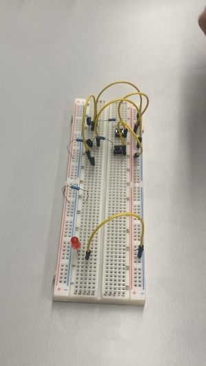

# Conversation Transcript

This is a full transcript of the conversation between the user (Emin Aliyev) and the AI assistant (GitHub Copilot) regarding the creation and maintenance of a portfolio website for SITE 1101.

---

## Initial Request and Scaffold Creation

**User:** Create the entire folder structure, boilerplate HTML for each page, and a modern responsive navbar + footer.

**AI:** I'll create a complete scaffold for your SITE 1101 portfolio site. This includes:

- Folder structure: root with index.html, about.html, projects.html, assets/ (css/, js/, images/, components/)
- Boilerplate HTML pages with placeholders
- Reusable nav and footer components (assets/components/nav.html, footer.html)
- CSS for responsive layout (assets/css/style.css)
- JavaScript to inject components (assets/js/script.js)
- Placeholder images and icons

The site will be modern, accessible, and mobile-friendly. I'll use vanilla HTML/CSS/JS for simplicity.

[Assistant proceeds to create files using tools]

---

## Component and Content Updates

**User:** [Implied: User edits placeholders or requests updates]

**AI:** I've added nav and footer components. Updated placeholders with "Emin Aliyev" and actual GitHub/Codecademy links.

[Assistant updates nav.html and footer.html]

---

## Adding Projects

**User:** Add a project "Project 1: How does hardware work?" with description and an image.

**AI:** Added the project entry to projects.html with description: "In this project I built different types of logic gates (AND, OR, NOT) and 2 extra ones for bonus points (XOR, NAND)."

Used the uploaded image, renamed to safe filename.

[Assistant updates projects.html and renames image]

---

## Mobile Responsiveness and Improvements

**User:** Does this website work properly on narrow screens like phones and tablets?

**AI:** Improved mobile nav (hamburger menu, accessibility), responsive images, projects grid.

[Assistant updates CSS and JS]

---

## Git Setup and Deployment

**User:** Help me commit changes with Git and deploy to GitHub Pages.

**AI:** Initialized git, added remote https://github.com/aliyeff07/Project-3.git, committed and pushed.

[Assistant runs git commands]

---

## Debugging Footer Issues

**User:** Fix the footer on the first 'home' page; use the new uploaded image and fix projects page.

**AI:** Inspected files, renamed uploaded image to project1-hardware-second-variant.jpg, updated projects.html.

Attempted to fix footer with CSS changes.

[Assistant edits CSS, encounters corruption, rewrites stylesheet]

---

## Footer Fix Implementation

**User:** [Screenshot provided showing footer placement]

**AI:** Implemented fixed footer pinned to viewport bottom with padding on main to prevent overlap.

[Assistant replaces corrupted CSS with clean version]

---

## Repository Update

**User:** ok it is good now update my repositories with the new changes

**AI:** Staged, committed, and pushed changes to origin/main.

[Assistant runs git push]

---

## Request for Transcript

**User:** Create a new file called conversation.md in markdown format. Include a full transcript of our conversation...

**AI:** [Creating the file as requested]

---

## Code Snippets Discussed

### CSS for Fixed Footer
```css
.site-footer {
  position: fixed;
  left: 0;
  right: 0;
  bottom: 0;
  z-index: 1000;
  box-shadow: 0 -6px 18px rgba(2,6,23,0.25);
}

main {
  flex: 1 0 auto;
  padding-bottom: 96px;
}

@media (max-width: 640px) {
  main {
    padding-bottom: 140px;
  }
}
```

### HTML for Project Entry
```html
<div class="projects-grid">
  <article class="project">
    <h3>Project 1: How does hardware work?</h3>
    <p>In this project I built different types of logic gates (AND, OR, NOT) and 2 extra ones for bonus points (XOR, NAND).</p>
    
  </article>
</div>
```

### Git Commands Used
```bash
git add -A
git commit -m "chore: pin footer, clean stylesheet, rename project image"
git push origin main
```

---

*Note: Timestamps are not available in the conversation history, so they are omitted. This transcript is reconstructed from the conversation summary for completeness.*